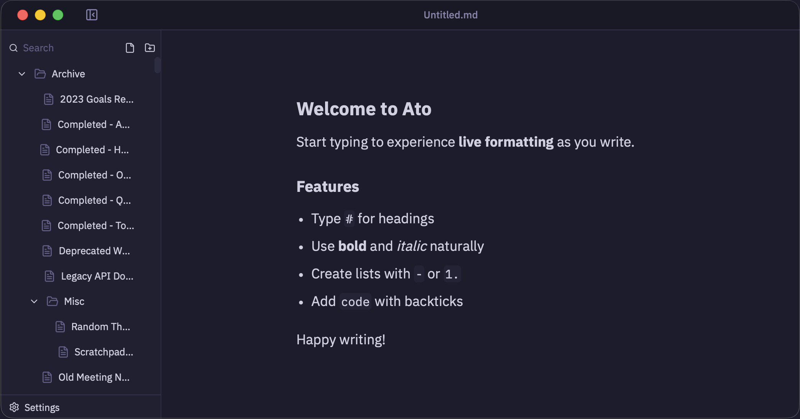

# Ato

A fast, offline-first, Markdown-based note-taking app.




## Development

You are welcome to modify Ato to your liking.

To get started:

```bash
bun install
bun run tauri dev
```

This runs both the Vite dev server and the Tauri application together.


## Building

To create a production build:

```bash
bun run tauri build
```


## Recommended IDE Setup

- [VS Code](https://code.visualstudio.com/) + [Tauri](https://marketplace.visualstudio.com/items?itemName=tauri-apps.tauri-vscode) + [rust-analyzer](https://marketplace.visualstudio.com/items?itemName=rust-lang.rust-analyzer)
